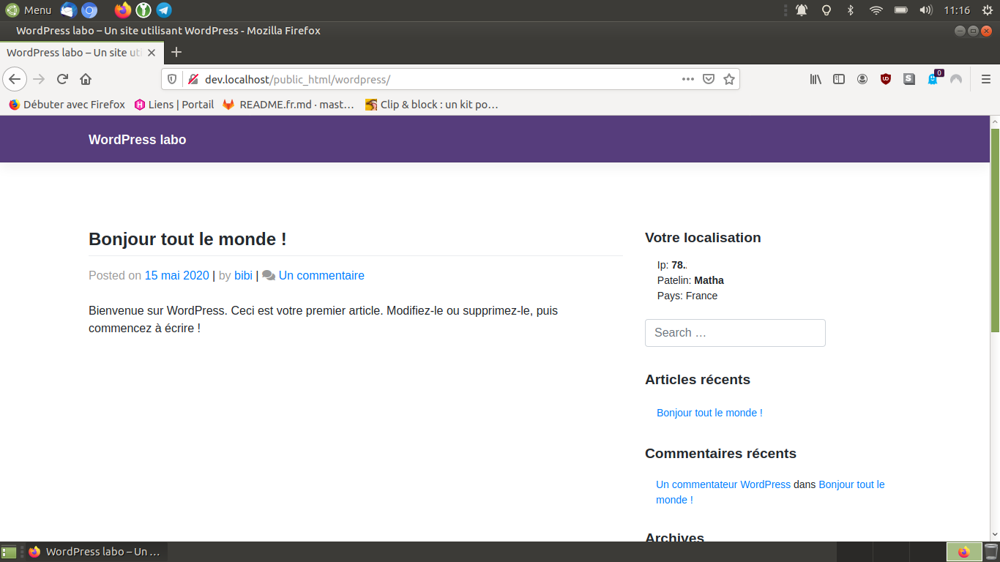

> **Description du projet**: Widget WordPress réalisé pour apprendre, celui-ci donne l'adresse IP et généralement la ville et le pays du visiteur.

* * *

## Inspiration(s), source(s)

* bibibricodeur

## License

[The Unlicense](https://choosealicense.com/licenses/unlicense/)

### Fin
